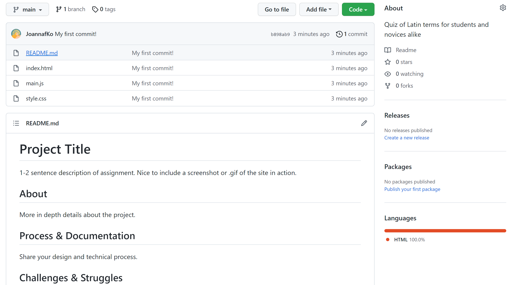
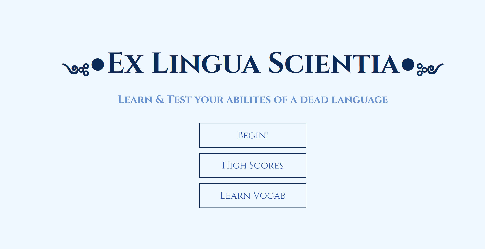
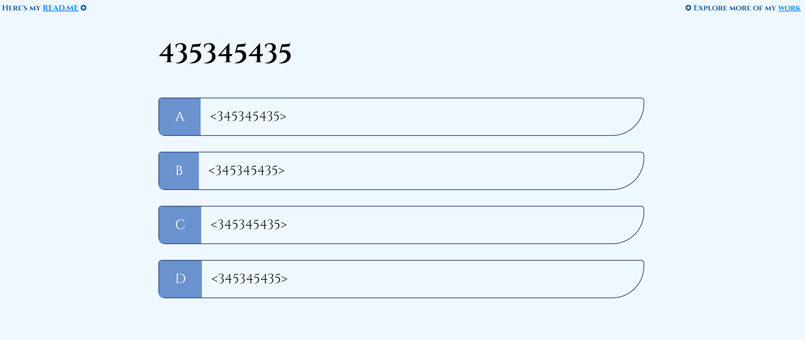
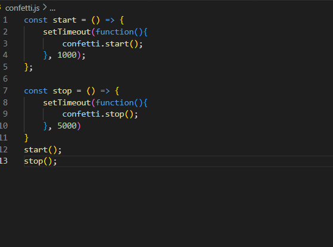
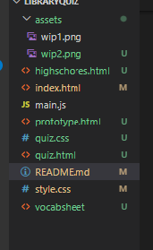
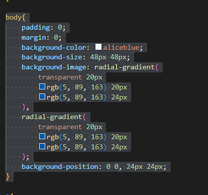

# For the Community: An Interactive Quiz or Tool
This is a quiz to help both novices and Latin students learn about the Latin language
 ## About
This project is a learning tool targeted at students in Latin class, or just novices who wish to learn Latin. The website is a quiz full of Latin vocabulary (contained in a table), and a dictionary that explains the etymologies of the latin words, and how they are roots for our modern day languages. This project incorporates localStorage via the scores by saving the most recent player score, and displaying it at the end screen.

## Process & Documentation
I first got creating a repo over with, because I would forget how to do so later on in the project. Then I looked into a video series about making a quiz or game for HTML, CSS, and Javascript, and I followed it while making my own customization

I sprinkled in Latin phrases and words throughout the website, to fit with the language theme. I even tweeked some of them a bit. I took the phrase "ex luna scientia," which means "knowledge from the moon," and turned it into "ex lingua scientia," which means "knowledge from language"

Since I'm using a video tutorial to create this project, I decided on adding my own touches to it, so that it is identifiable and my own. I created a page reserved for the terminolgies. So I decided on creating dictionarites for the Latin terms, and difficulty modes. I rant into a bit a trouble with creating the functions, mainly because I mispelled it. I also considered a page of flashcards, but ultimately decided against it because of time and lack on information on how to create it.

I have thought about using roman numerals instead of numbers, but I passed it over due to time constraints, and that it would be difficult for even the begginer and student to understand the numeric values. I decided on using the roman numerals in the difficulty modes instead, as a ranking of some sorts.

I also tried adding a confetti animation to the end screen, but despite following the video tutorial, it, like the background pattern, didn't show up too

## Challenges & Struggles
First challenge I got involved in was with the folders. I initially tried to catergorize the extra HTML and CSS files into different folders, but when I tried to attatch the style sheet to them, the script wouldn't visually show up. I ultimately gave up on the folders, it made things too complicated.

Another challenge I ran into was fetching API. When I tried to place the array into a JSON file. It mostly worked, except when I tried clicking on the answers of the questions, it did not go to the next questions. It got extremely annoying, as I planned on having about 400 terms and questions. So I decide to just go the hard route

I also tried adding a pattern to the site, however, when I tried to follow the video tutorial, it did not have the pattern show up, despite tagging it in the body. So I ended up dropping that too. If there is time near the end, I may try and fix it.

## References

[Build a Quiz App with HTML, CSS, and JavaScript](https://youtube.com/playlist?list=PLDlWc9AfQBfZIkdVaOQXi1tizJeNJipEx)

[25: Table In HTML and CSS | How To Create Tables | Learn HTML and CSS | HTML Tutorial | CSS Tutorial](https://www.youtube.com/watch?v=dK27jWKtJxs)

[Latin Vocab](https://quizlet.com/Jojo0821/folders/latin-vocab/sets)

[Cinzel](https://fonts.google.com/specimen/Cinzel#standard-styles)

[List of Greek and Latin roots in English](https://www.oakton.edu/user/3/gherrera/Greek%20and%20Latin%20Roots%20in%20English/greek_and_latin_roots.pdf)